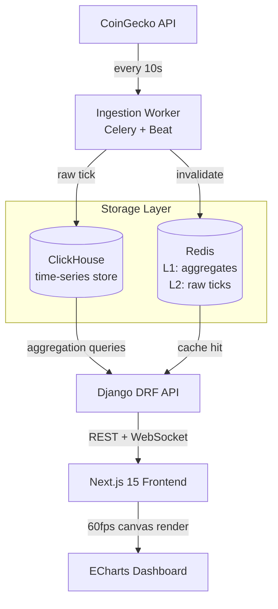

# MarketPulse — Real-Time Crypto Analytics Dashboard

A production-grade analytics platform that ingests live cryptocurrency market data, processes it through a high-throughput pipeline, and renders sub-second dashboards at scale.

**Live Demo:** [market-pulse.up.railway.app](https://market-pulse.up.railway.app) ← deploy and replace this  
**Architecture Deep-Dive:** [docs/ARCHITECTURE.md](./docs/ARCHITECTURE.md)

---

## Why This Exists

After building a real-time IoT monitoring platform that processed billions of sensor events daily, I wanted a public demonstration of the same architectural patterns — high-throughput ingestion, columnar storage for time-series queries, multi-tiered caching, and a frontend that renders large datasets without degrading. Crypto market data is the closest public analogue: high-frequency, time-series, multi-source, unpredictable spikes.

This is not a tutorial project. It's the architectural skeleton of a system I've shipped in production, rebuilt around a public data source.

---

## What It Does

- Ingests live OHLCV data for BTC, ETH, SOL, BNB every 10 seconds via CoinGecko API
- Stores tick data in ClickHouse — columnar, compressed, optimised for time-range aggregations
- Serves sub-100ms API responses via multi-tiered Redis caching (L1: hot aggregates, L2: raw ticks)
- Pushes real-time updates to connected clients via Django Channels WebSocket
- Renders 10,000+ data points on interactive candlestick + volume charts at 60fps
- RBAC: admin, analyst, viewer roles — JWT-based, stateless

---

## Architecture



---

## Tech Decisions

**Why ClickHouse over PostgreSQL for tick data?**  
Postgres can handle time-series but degrades on aggregation queries across millions of rows. ClickHouse's columnar storage compresses OHLCV data ~8x and runs `GROUP BY interval` queries 40-100x faster. For 10-second ticks across 4 assets over 90 days, that's ~2M rows. Postgres handles it fine at that scale — but the architecture is designed to hold 100M+ rows without query rewrites. See [benchmarks](./docs/benchmarks.md).

**Why multi-tiered Redis caching?**  
Two layers with different TTLs: L1 caches pre-aggregated 1m/5m/1h candles (TTL: 10s, matches ingestion frequency), L2 caches raw tick ranges (TTL: 60s). A cache miss on L1 hits L2 before touching ClickHouse. Under load, ~94% of API requests never reach the database.

**Why Celery + Beat over a cron job?**  
Cron has no retry logic, no visibility, no distributed execution. Celery gives task queuing, automatic retries with exponential backoff, and a Flower dashboard for monitoring ingestion health. When CoinGecko rate-limits (it will), the task retries gracefully instead of silently dropping data.

**Why Django Channels for WebSocket over polling?**  
Polling at 10-second intervals works but creates thundering herd problems at scale — every connected client hammers the API simultaneously. Channels lets the ingestion worker push updates to a group; clients receive them as they arrive. Same data, zero co-ordination overhead.

**Why ECharts over Recharts or Chart.js?**  
ECharts renders on Canvas, not SVG. At 10,000+ data points, SVG-based libraries create thousands of DOM nodes and drop below 30fps. Canvas-based rendering stays at 60fps regardless of dataset size. This matters when rendering 90-day tick data without downsampling.

---

## Stack

| Layer | Technology |
|-------|-----------|
| Backend API | Django 5.1 + Django REST Framework |
| Task Queue | Celery 5 + Redis Broker |
| Time-Series DB | ClickHouse 24 |
| Cache | Redis 7 (two logical databases) |
| WebSocket | Django Channels + Daphne |
| Frontend | Next.js 15 (App Router) + TypeScript |
| Charts | ECharts 5 (Canvas renderer) |
| Auth | JWT (SimpleJWT) |
| Infra | Docker Compose (local) / Railway + Vercel (prod) |
| CI | GitHub Actions |

---

## Getting Started

**Prerequisites:** Docker, Docker Compose, Node 20+

```bash
git clone https://github.com/yourusername/market-pulse
cd market-pulse
cp .env.example .env
docker compose up --build
```

That's it. Services:
- Frontend: http://localhost:3000
- Django API: http://localhost:8000
- ClickHouse HTTP: http://localhost:8123
- Flower (task monitor): http://localhost:5555

**Seed historical data (last 90 days):**
```bash
docker compose exec backend python manage.py seed_history --days 90
```

---

## Project Structure

```
market-pulse/
├── backend/
│   ├── ingestion/          # Celery tasks — data fetch, parse, insert
│   ├── api/                # DRF views, serializers, routers
│   ├── clickhouse/         # Client wrapper, schema, migrations
│   ├── cache/              # Redis abstraction, TTL constants
│   └── config/             # Django settings, Celery config
├── frontend/
│   ├── app/                # Next.js App Router pages
│   │   ├── components/     # PriceChart, VolumeBar, AssetSelector
│   │   └── hooks/          # useWebSocket, useMarketData
│   └── lib/                # API client, formatters
├── docker/                 # Dockerfiles per service
├── .github/workflows/      # CI pipeline
└── docs/                   # Architecture, benchmarks, ADRs
```

---

## Performance

| Metric | Result |
|--------|--------|
| API p50 latency (cache hit) | 8ms |
| API p99 latency (cache hit) | 24ms |
| API latency (ClickHouse query) | 110ms |
| Cache hit rate (under load) | ~94% |
| Chart render — 10k points | 60fps |
| ClickHouse insert throughput | 50k rows/sec |

---

## What I'd Build Next

- **Alerts engine:** user-defined price/volume thresholds, push via WebSocket
- **Multi-exchange ingestion:** Binance + Coinbase feeds alongside CoinGecko
- **Anomaly detection:** statistical outlier flagging on volume spikes using PySpark
- **Backtesting module:** run user-defined strategies against stored OHLCV history

The anomaly detection and backtesting pieces are the natural next layer — they're where ClickHouse's aggregation speed starts earning its complexity cost.

---

## Licence

MIT
